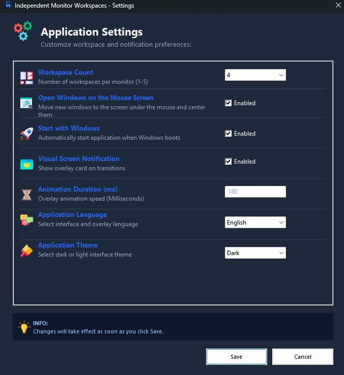
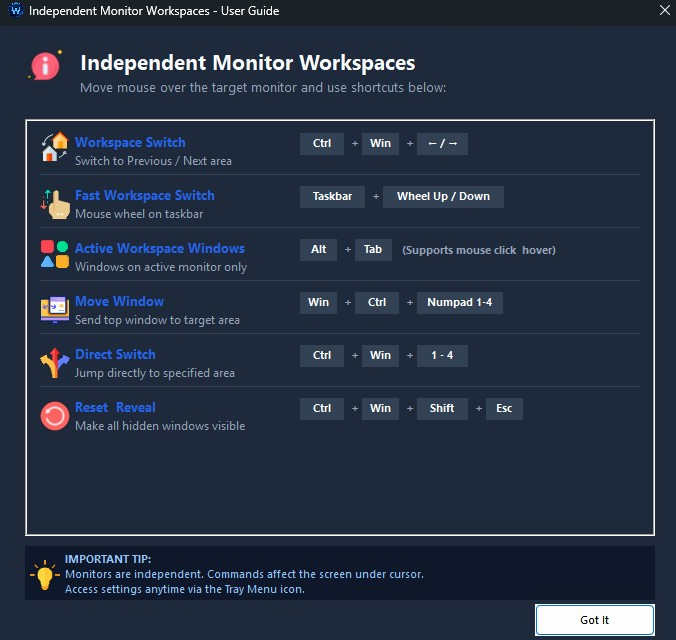
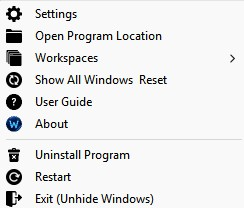
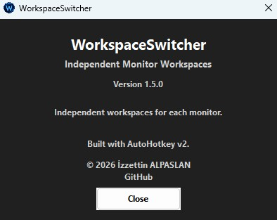

# WorkspaceSwitcher

## Download

Download the latest version from the GitHub Releases page:

[Download WorkspaceSwitcher v1.5.0](https://github.com/izzetalpha/WorkspaceSwitcher/releases/latest)

**Independent Monitor Workspaces for Windows**

WorkspaceSwitcher is a Windows workspace manager developed with **AutoHotkey v2**.

It allows each monitor to have independent workspaces and provides a custom Alt+Tab interface for managing windows between workspaces using the mouse or keyboard.

## Features

* Independent workspaces for each monitor
* Custom Alt+Tab interface
* Move windows between workspaces using the mouse
* Keyboard shortcuts for workspace switching
* Up to 5 configurable workspaces
* Optional mouse-screen based window placement
* Multi-monitor support
* System tray controls
* Workspace overlay notifications
* Dark and light themes
* Turkish and English language support
* Windows startup support
* Reset and restore windows
* Custom application icons
* Built-in installation and uninstall support


## Keyboard Shortcuts

| Shortcut                   | Action                                    |
| -------------------------- | ----------------------------------------- |
| `Win + Ctrl + 1–5`         | Switch to workspace                       |
| `Win + Ctrl + Numpad 1–5`  | Move the active window to a workspace     |
| `Win + Ctrl + Left`        | Previous workspace                        |
| `Win + Ctrl + Right`       | Next workspace                            |
| `Win + Ctrl + Shift + Esc` | Reset and reveal all windows              |
| `Alt + Tab`                | Open the custom window switcher           |
| `Alt + Shift + Tab`        | Navigate backwards in the window switcher |

The number of available workspaces can be configured from the application settings.

## System Tray

WorkspaceSwitcher provides controls from the Windows system tray, including:

* Settings
* Open Program Location
* Workspace selection
* Reset workspaces
* Help
* About
* Uninstall
* Restart
* Exit

Double-clicking the tray icon opens the custom window switcher.

## Installation

### Recommended: Compiled Version

Download the latest `WorkspaceSwitcher.exe` from the **Releases** section and run it.

The application can install itself under:

```text
C:\Program Files\WorkspaceSwitcher
```

Administrator privileges are required for installation and for some window-management operations.

### Running from Source

To run the source code, install **AutoHotkey v2** and run:

```text
WorkspaceSwitcher.ahk
```

The source version does not perform the compiled-program installation process.

## Building

The project is written for:

**AutoHotkey v2**

The application can be compiled using the AutoHotkey compiler.

The required application icons are located in the `icon` directory and are also embedded into the compiled executable.

## Configuration

WorkspaceSwitcher provides settings for:

* Number of workspaces
* Language
* Theme
* Visual feedback
* Animation duration
* Mouse-screen based window placement
* Windows startup

## Screenshots

### Custom Alt+Tab

Custom window switcher for quickly navigating between applications.


### Settings

Configure workspaces, language, theme, animations and other options.



### User Guide

Built-in user guide for learning the application's features and keyboard shortcuts.



### System Tray

Quick access to workspaces and application controls from the Windows system tray.



### About

Application information and direct access to the GitHub repository.




## Version

Current version:

**1.5.0**

## Author

**İzzettin ALPASLAN**

Developed as a free Windows utility for managing independent workspaces across multiple monitors.

## License

This project is licensed under the MIT License.

See the `LICENSE` file for details.

## Contributing

Suggestions, bug reports and improvements are welcome.

Please use the GitHub Issues section to report bugs or suggest new features.
